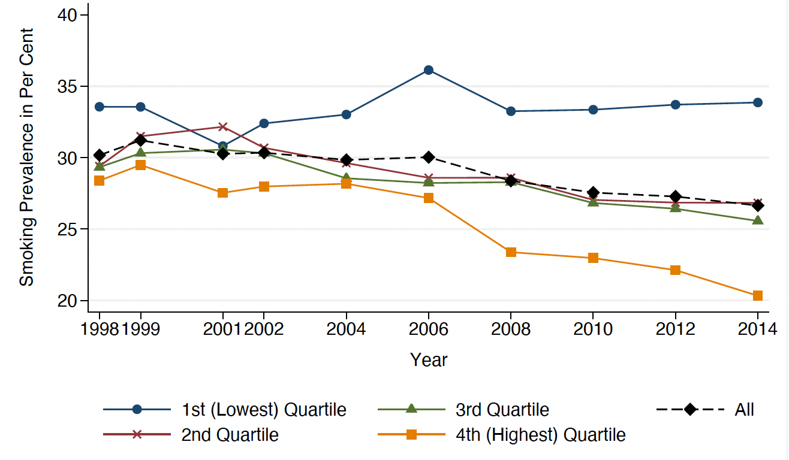
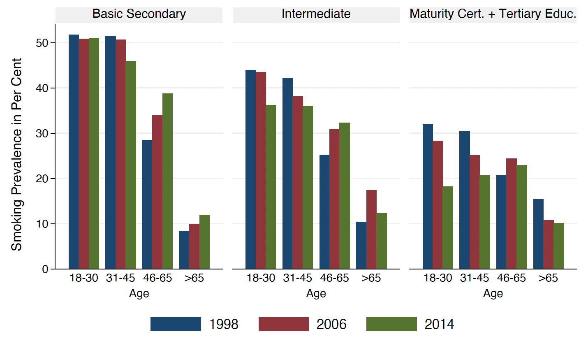

    
# Introduction

## Background and Motivation

Tobacco use remains one of the leading preventable causes of morbidity and premature mortality in Germany, contributing significantly to the national burden of cardiovascular and respiratory diseases. Despite sustained public health campaigns, regulatory efforts, and taxation policies, smoking prevalence in Germany remains comparatively high among high-income countries. Particularly concerning is the persistent concentration of smoking among socioeconomically disadvantaged populations, where declines in prevalence have been slower and smoking-related harm more pronounced.

Importantly, socioeconomic disparities in smoking behavior do not occur in isolation but intersect with demographic characteristics such as age, gender, and education. Evidence from @siegel_measuring_2014 suggests that younger adults exhibit the greatest levels of income-related inequality in smoking prevalence, while such disparities diminish with age—likely reflecting cohort effects. Similarly, educational attainment plays a central role in shaping both the initiation and cessation of smoking, with lower-educated individuals more likely to smoke and less likely to quit. Gender differences persist as well: although the gap has narrowed in recent decades, men remain more likely to smoke than women, particularly among lower socioeconomic groups.

These intersecting factors highlight the importance of adopting a multivariate analytical perspective to disentangle the independent effect of income on smoking behavior while accounting for key sociodemographic variables. Understanding how income interacts with age, gender, and education is essential not only for statistical accuracy but also for designing effective, equity-oriented public health interventions. Reducing smoking-related health inequalities in Germany requires policies that are responsive to these structural and demographic realities.

## Research Aim and Structure of the Paper
This study investigates the following central question:

>Does individual income remain a significant predictor of smoking prevalence in Germany when controlling for age, gender, and education?

By addressing this question, the paper aims to assess whether income remains an independent and statistically significant predictor of smoking behavior when accounting for key sociodemographic variables. This approach responds to prior research highlighting the multidimensional nature of smoking disparities and the need for integrated analysis.

To answer this question, the paper proceeds as follows. The next section outlines the theoretical framework and reviews prior literature on the socioeconomic determinants of smoking, with a focus on the German context. The subsequent sections describe the data source, define and recode the variables, and explain the methodological approach. Descriptive analyses then explore smoking patterns across income, education, age, and gender. The multivariate analysis includes a logistic regression model estimating the independent effect of income on smoking likelihood, complemented by predicted probability plots. Finally, the paper concludes with a discussion of limitations, policy implications, and directions for future research.


# Theoretical Framework and Literature Review
## Smoking and Socioeconomic Inequality

Understanding the socioeconomic determinants of smoking behavior requires examining how disparities emerge and evolve across the life course. For a more comprehensive perspective, it is essential to begin with patterns that originate in early life. While most research on income-related smoking disparities focuses on adults, studies on adolescents provide valuable insight into the developmental foundations of these behaviors. @perelman_association_2017, in a cross-sectional study conducted across six European cities, including Hannover, Germany, found that higher personal income among adolescents was significantly associated with increased likelihood of smoking experimentation, weekly smoking, and daily smoking, even after adjusting for family socioeconomic status (SES). Notably, the study also revealed that among adolescents from low-SES backgrounds, smoking intensity was not related to income, suggesting that access to cigarettes in these groups may depend more heavily on informal or social sources. These findings imply that individual-level financial resources can shape smoking behavior independently of structural SES and that such influences begin well before adulthood. This early-life evidence underscores the importance of investigating income-related smoking disparities throughout the entire life course, including among adults in the German population, which is the focus of this study.

Building on this early-life evidence, @siegel_measuring_2014 provides a nuanced picture of how income-related smoking inequalities manifest and shift throughout adulthood in the German context. Using data from the 2009 German Microcensus and a semiparametric concentration index approach, his analysis reveals that current smoking is disproportionately concentrated among lower-income individuals, particularly in younger age groups. In contrast, among older adults, the pattern reverses slightly, with smoking prevalence more evenly distributed or even concentrated among higher-income groups. This age-specific dynamic suggests that socioeconomic gradients in smoking are not static but evolve over time, reflecting both cohort effects and life-stage differences in health behavior.

Importantly,  @siegel_measuring_2014 also examines smoking cessation rates and finds a consistent pro-rich gradient across all age groups: higher-income ever-smokers are significantly more likely to have quit. This indicates that socioeconomic advantage not only reduces the likelihood of smoking uptake but also increases the ability to stop, potentially due to better access to cessation resources or greater health awareness. These findings emphasize that income plays a dual role in shaping both the initiation and discontinuation of smoking behavior.

A closer look at long-term national trends offers further insight into how income-based smoking disparities have evolved in Germany. Drawing on panel data from the Socio-Economic Panel (SOEP), @heilert_smoking_2017 documents a significant divergence in smoking prevalence across income groups between 1998 and 2014. While smoking rates declined consistently in the second, third, and fourth income quartiles, they remained persistently high, and in some years even increased, among individuals in the lowest income quartile. As Figure 1 shows, this pattern reflects a widening socioeconomic gradient in smoking, with the most disadvantaged group increasingly bearing the burden of tobacco use.

**Figure 1. Time series of smoking prevalence by income quartile (net equivalent household income), 1998–2014**

```{r fig1, echo=FALSE, out.width='80%', fig.align='center'}

```
<div style="text-align: center;"><em>Source: @heilert_smoking_2017</em></div>

The contrast becomes especially stark toward the end of the observation period: by 2014, individuals in the top income quartile had reduced their smoking prevalence to below 25%, while rates among those in the bottom quartile exceeded 35%. Notably, this divergence did not exist in the late 1990s, when smoking rates across income groups were more uniform. The emergence of this gradient over time reinforces the idea that structural disadvantage may not only shape exposure to risk factors but also limit responsiveness to health interventions.

Moreover, the SOEP data confirm that cessation dynamics mirror these disparities. Individuals who successfully quit smoking between 2002 and 2014 were disproportionately drawn from higher income and education brackets, while persistent heavy smoking, defined as more than 20 cigarettes per day, became increasingly concentrated among those with low income and limited educational attainment. These findings underline that smoking behavior in Germany is not merely an individual choice but is deeply embedded in broader socioeconomic conditions that shape both opportunities for cessation and exposure to long-term health risks.

In addition to income, gender and education are key dimensions of smoking inequality in Germany. Gender gaps persist across all age groups: men remain more likely to smoke than women, although this difference is gradually narrowing. According to @heilert_smoking_2017, male smoking has declined most notably among younger and higher-educated individuals, while smoking among older women has remained relatively stable over time.

Educational attainment shows an even stronger and more persistent association with smoking behavior. In 2014, smoking prevalence reached nearly 50% among individuals without a school-leaving certificate, compared to less than 20% among those with tertiary education. These gaps are especially pronounced in younger age groups, indicating that educational disparities in smoking now emerge earlier in life. 

As shown in Figure 2, smoking rates among 18–30-year-olds exceeded 50% for those with only basic secondary education across all observed years, while remaining below 35% for the tertiary-educated group. These differences narrow in older cohorts, suggesting a cohort shift: smoking has become increasingly concentrated among the less educated in younger generations, while it was more evenly distributed in the past. @heilert_smoking_2017

**Figure 2. Smoking prevalence by educational level and age group in Germany (SOEP 1998–2014)**

```{r, echo=FALSE}

```
<div style="text-align: center;"><em>Source: @heilert_smoking_2017</em></div>

These national patterns are consistent with global findings. A comprehensive systematic review and meta-analysis by @casetta_association_2016, covering 93 studies across Europe, the Americas, and Asia, found that individuals in the lowest income group had 69% higher odds of smoking compared to those in the highest group. The effect was particularly strong among women and adults, and a clear dose–response gradient was observed across all regions, including Europe (OR 1.45). These results highlight that income is a robust predictor of smoking prevalence worldwide and reinforce the relevance of examining income-related disparities in the German context.

## Hypotheses Development

The empirical evidence discussed above demonstrates that smoking behavior in Germany is systematically patterned by socioeconomic status, with both income and education serving as key predictors across multiple datasets and age groups. These associations are further shaped by gender and age, reflecting the dynamic nature of smoking behavior across the life course and among different population subgroups.

Taken together, the findings suggest that income should not be examined in isolation but rather analyzed in combination with demographic and educational variables in order to assess its independent contribution to smoking behavior. While previous research has identified bivariate associations between income and smoking, fewer studies have tested whether this relationship persists in multivariate frameworks.

This study therefore addresses the following research question:

> Does individual income remain a significant predictor of smoking prevalence in Germany when controlling for gender, age, and education?

Guided by this question and the preceding literature, the following hypotheses are proposed:

>**H1**: Higher income is associated with a lower likelihood of smoking  <br>
>**H2**: Younger individuals are more likely to smoke than older individuals<br>
>**H3**: Men are more likely to smoke than women<br>
>**H4**: Higher levels of education are associated with a lower likelihood of smoking<br>

These hypotheses will be empirically tested using individual-level data from the European Social Survey (ESS Round 11, 2022), which offers high-quality, nationally representative data on social attitudes and behaviors across Europe. The following section outlines the data source, describes the operationalization of key variables, and explains the preprocessing steps undertaken to prepare the dataset for analysis.


# Data and Methodology
## Data Source

This study uses data from Round 11 (2022) of the European Social Survey (ESS), specifically the German sample. The ESS is a cross-sectional, cross-national survey conducted every two years across European countries. Its goal is to monitor long-term trends in public attitudes, beliefs, and behaviors.

In Germany, the Round 11 data collection was carried out between September 2022 and April 2023 through face-to-face interviews, using computer-assisted personal interviewing (CAPI). The net sample size was 2,420 respondents, and the survey design followed a probability-based, representative sampling strategy, ensuring national coverage of individuals aged 15 years and older living in private households, regardless of nationality, as long as they could be interviewed in German. @stoop_improving_2010 The German survey data from Round 11 therefore provide a reliable and up-to-date basis for analyzing smoking behavior in relation to income and background characteristics. 

## Variable Definitions and Preparation

To investigate the relationship between income and smoking behavior in Germany, this section defines and operationalizes the key variables used in the empirical analysis. Based on theoretical relevance and prior literature, five core variables are selected: **smoking status**, **household income**, **age**, **gender**, and **education**. All variables are drawn from the German subsample of the European Social Survey Round 11 (2022) and are recoded according to the official ESS codebook to ensure analytical validity and comparability.

The analytic sample is restricted to respondents residing in Germany `(cntry == "DE")`. Non-substantive responses such as “Refusal,” “Don’t know,” and “No answer” were treated as missing values `(NA)` during data preprocessing. To ensure consistent estimation and valid inference, a complete-case analysis was conducted: only respondents with non-missing values on all five variables were retained in the final dataset. As a result, 272 cases with missing information were excluded, yielding a final analytical sample of 2,157 respondents. All data transformation and filtering procedures were performed in R.

The subsections below provide a detailed overview of each variable, including original response categories and the recoding steps used to prepare the data for logistic regression modeling.

```{r library, include=FALSE}
# Load essential packages
library(tidyverse)      # For data manipulation and visualization
library(janitor)        # For cleaning variable names
library(haven)          # Import SPSS/Stata files
library(sjPlot)         # For regression tables and visualizations
library(marginaleffects) # For marginal effects and predicted probabilities
library(ggplot2)        # For Visualisation
library(patchwork)
library(RColorBrewer)
```

```{r import data, include=FALSE}
ess_data <- read_csv("/Users/anihovhannisyan/Desktop/MASS/Paper/project_final/ESS11.csv")

# Filter for Germany
germany_data <- ess_data %>% filter(cntry == "DE")

# Relevant variables
df <- germany_data %>%
  select(
    cgtsmok,     # current smoking behavior (to become outcome)
    hinctnta,    # household net income decile
    agea,        # age in years
    gndr,        # gender
    eisced       # education level (ISCED scale)
  )
```

**Dependent Variable: Smoking Behavior (cgtsmok → smoker)**

Smoking behavior is measured using the variable `cgtsmok`, which captures current and past smoking habits. To operationalize a binary outcome suitable for logistic regression, responses were recoded into a new variable **smoker**:

> 1 = Smoker (codes 1–3: smokes daily or occasionally)        <br>
> 0 = Non-smoker (codes 4–6: former, rare, or never smoked)   <br>
> NA = Missing (codes 7–9: refusal, don’t know, no answer)    <br>

This transformation captures the conceptually relevant distinction between current smokers and non-smokers and serves as the dependent variable in the analysis.

```{r smoker, include=FALSE}
df <- df %>%
  mutate(
    smoker = case_when(
      cgtsmok %in% 1:3 ~ 1,      # Smokes daily or occasionally
      cgtsmok %in% 4:6 ~ 0,      # Former, rare, or never smoked
      cgtsmok %in% 7:9 ~ NA_real_  # Refused, don't know, no answer
    )
  )

# check
table(df$smoker, useNA = "always")

```

**Independent Variable: Household Income (hinctnta → income)**

Household income was measured using the variable `hinctnta`, which asked respondents to report their total net household income (after taxes and compulsory deductions) from all sources. Responses were recorded on a decile scale ranging from the lowest (1) to the highest (10) national income groups. To enable analysis, the variable was recoded into a new numeric variable **income**:

> 1–10 = Valid income deciles (ordinal scale from lowest to highest) <br>
> NA = Missing (codes 77 = refusal, 88 = don’t know, 99 = no answer)

```{r income, include=FALSE}
df <- df %>%
  mutate(
    income = case_when(
      hinctnta %in% 1:10 ~ hinctnta,
      hinctnta %in% c(77, 88, 99) ~ NA_real_
    )
  )

table(df$income, useNA = "always")
```

**Control Variable: Age (agea → age)**

Age was measured using the variable `agea`, which recorded the respondent’s age in completed years. For analysis, the variable was recoded into a continuous numeric variable **age**:

> Valid = Respondent’s age in years (numeric) <br>
> NA = Missing (code 999 = not available)

```{r age, include=FALSE}
df <- df %>%
  mutate(
    age = case_when(
      agea == 999 ~ NA_real_,
      TRUE ~ agea
    )
  )

table(df$age, useNA = "always")
```

**Control Variable: Gender (gndr → gender)**

Gender was measured using the variable `gndr`, which recorded the respondent’s self-identified sex. For analysis, the variable was recoded into a binary indicator variable gender:

>1 = Male <br>
>0 = Female <br>
>NA = Missing (code 9 = no answer)

```{r gender, include=FALSE}
df <- df %>%
  mutate(
    gender = case_when(
      gndr == 1 ~ 1,
      gndr == 2 ~ 0,
      gndr == 9 ~ NA_real_
    )
  )

table(df$gender, useNA = "always")
```

**Control Variable: Education Level (eisced → education)**

Education level was measured using the variable `eisced`, based on the International Standard Classification of Education (ISCED). For analysis, the variable was recoded into an ordered factor education with three categories:

>**Low** = ISCED 1–2 (lower secondary or below) <br>
>**Medium** = ISCED 3–4 (upper secondary and post-secondary non-tertiary) <br>
>**High** = ISCED 5–7 (tertiary education: vocational, BA, MA level) <br>
>**NA** = Missing (codes 0, 55, 77, 88, 99)

```{r education, include=FALSE}
df <- df %>%
  mutate(
    education = case_when(
      eisced %in% c(1, 2) ~ "Low",
      eisced %in% c(3, 4) ~ "Medium",
      eisced %in% c(5, 6, 7) ~ "High",
      eisced %in% c(0, 55, 77, 88, 99) ~ NA_character_
    ),
    education = factor(education, levels = c("Low", "Medium", "High"), ordered = TRUE) # categorical Variable
  )

table(df$education, useNA = "always")
```

```{r clean, include=FALSE}
df_clean <- df %>%
  select(smoker, income, age, gender, education) %>%
  drop_na()

summary(df_clean)
str(df_clean)
```


# Exploratory Data Analysis (EDA)
## Descriptive Statistics

Before conducting the multivariate analysis, this section presents a series of descriptive statistics to provide an overview of the sample characteristics and preliminary patterns in smoking behavior across key socio-demographic variables. The visualizations in Figure 3 display the univariate distributions of all model variables based on the cleaned ESS subsample for Germany.

**Figure 3. Distribution of Smoking, Gender, Education, Age and Income**

```{r figure 3_distribution_plots, echo=FALSE}
# Define custom blues (5 levels from "Blues")
blues <- brewer.pal(5, "Blues")
solid_blue <- blues[4]

# 1. Age histogram
p1 <- ggplot(df_clean, aes(x = age)) +
  geom_histogram(bins = 30, fill = solid_blue, color = "white") +
  labs(title = "Distribution of Age", x = "Age", y = "Count") +
  theme_minimal()

# 2. Income
p2 <- ggplot(df_clean, aes(x = factor(income))) +
  geom_bar(fill = solid_blue) +
  labs(title = "Household Income Deciles", x = "Income Decile", y = "Count") +
  theme_minimal()

# 3. Smoking Status
p3 <- ggplot(df_clean, aes(x = factor(smoker, labels = c("Non-Smoker", "Smoker")), fill = factor(smoker))) +
  geom_bar() +
  scale_fill_manual(values = c(blues[2], blues[5])) +
  labs(title = "Smoking Status", x = "Status", y = "Count") +
  theme_minimal() +
  theme(legend.position = "none")

# 4. Gender
p4 <- ggplot(df_clean, aes(x = factor(gender, labels = c("Female", "Male")), fill = factor(gender))) +
  geom_bar() +
  scale_fill_manual(values = c(blues[3], blues[5])) +
  labs(title = "Gender", x = "Gender", y = "Count") +
  theme_minimal() +
  theme(legend.position = "none")

# 5. Education
p5 <- ggplot(df_clean, aes(x = education, fill = education)) +
  geom_bar() +
  scale_fill_manual(values = c(blues[2], blues[4], blues[5])) +
  labs(title = "Education Level", x = "Education", y = "Count") +
  theme_minimal() +
  theme(legend.position = "none")

# Combine
(p3 | p4 | p5) / (p1 | p2)
```

The top-left panel illustrates the **age distribution** of the sample. Respondents range from adolescence to old age, with most observations clustered between the ages of 40 and 65. This age composition reflects the demographic reality of Germany’s aging population and ensures sufficient variation for age-stratified analysis.

To the right, the **household income decile distribution** is shown. Although all income groups are represented, there is a visible skew toward higher income brackets, particularly in the tenth decile. This may reflect patterns of differential survey participation or higher item-response rates among higher-income individuals.

The lower-left panel displays the **distribution of smoking status**, which was dichotomized into smokers and non-smokers. The majority of respondents in the sample are non-smokers (n ≈ 1,700), while a smaller group (n ≈ 500) reported being current smokers. These counts correspond to approximately 77% non-smokers and 23% smokers, reflecting a continuing decline in smoking prevalence consistent with national health trends. Despite this overall reduction, the absolute number of smokers remains substantial, underscoring the continued public health relevance of tobacco use in Germany. This descriptive overview provides a strong rationale for further investigating how smoking behavior varies across income, age, gender, and education.

The **gender distribution**, presented in the center panel, is nearly balanced, with a slightly larger share of male respondents. This gender parity is beneficial for testing sex-specific smoking patterns, especially given the persistence of gender-based disparities in tobacco use documented in previous literature.

Finally, the **education level** of respondents is depicted in the lower-right panel. The majority of individuals fall into the medium (upper secondary) or high (tertiary) education categories, while the low education group is comparatively small. These patterns are consistent with Germany’s contemporary educational attainment structure and allow for testing the educational gradient in smoking behavior.

The following visualization provides a closer look at the educational gradient in smoking behavior observed in the German subsample of the ESS. Figure 4 displays the proportion of current smokers and non-smokers within each education group, allowing for a clear assessment of how smoking prevalence varies across levels of educational attainment.

**Figure 4. Smoking prevalence by education level among adults in Germany (ESS Round 11, 2022)**

```{r figure4, echo=FALSE}
ggplot(df_clean, aes(x = education, fill = factor(smoker, labels = c("Non-Smoker", "Smoker")))) +
  geom_bar(position = "fill", aes(y = after_stat(prop), group = smoker)) +
  scale_y_continuous(labels = scales::percent_format(accuracy = 1)) +
  scale_fill_manual(values = c("#2171B5", "#9ECAE1")) +
  labs(
    x = "Education Level",
    y = "Share of Respondents",
    fill = "Smoking Status"
  ) +
  theme_minimal(base_size = 12) +
  theme(axis.title = element_text(face = "bold"))
```

As the figure shows, smoking is substantially more prevalent among individuals with lower levels of education. Among those with low educational attainment, smokers make up nearly two-thirds of the group, while the share of non-smokers increases progressively with education. In contrast, individuals with high education levels are more likely to be non-smokers, with smokers constituting less than half of this subgroup.

This pattern aligns with the broader literature documenting a persistent inverse relationship between education and smoking. Higher educational attainment may reflect greater exposure to health-related information, stronger future orientation, and greater access to cessation resources — all of which contribute to lower smoking prevalence. Conversely, lower education levels are often associated with environments where smoking is more normalized and access to preventive health information is more limited.

To further explore the sociodemographic patterning of smoking behavior, Figure 5 presents the distribution of smokers and non-smokers by gender, based on the German subsample of the ESS.

**Figure 5: Smoking prevalence by gender among adults in Germany (ESS Round 11, 2022)**

```{r figure5, echo=FALSE}
# Smoking by Gender (Proportional)
ggplot(df_clean, aes(x = factor(gender, labels = c("Female", "Male")))) +
  geom_bar(
    aes(y = after_stat(prop), fill = factor(smoker, labels = c("Non-Smoker", "Smoker")), group = smoker),
    position = "fill"
  ) +
  scale_y_continuous(labels = scales::percent) +
  scale_fill_manual(values = c("#2171B5", "#9ECAE1")) +
  labs(
    x = "Gender",
    y = "Share of Respondents",
    fill = "Smoking Status"
  ) +
  theme_minimal()
```

The figure reveals a modest but visible gender gap in smoking prevalence. Male respondents exhibit a slightly higher share of current smokers compared to females. Conversely, female respondents are more likely to be non-smokers, reinforcing findings from previous studies on gendered smoking behavior in Germany (e.g., @heilert_smoking_2017).

While the magnitude of the difference is not extreme, it is directionally consistent with long-standing public health literature indicating higher smoking rates among men, particularly in earlier generations. These patterns underscore the importance of controlling for gender when examining the effects of income and education on smoking behavior and offer preliminary support for Hypothesis 3.

The next visualization focuses on the relationship between household income and smoking prevalence. While earlier figures explored gender and education, Figure 6 presents the share of current smokers across income deciles, offering a first look at the income-smoking gradient in Germany.

**Figure 6: Smoking prevalence by household income decile among adults in Germany (ESS Round 11, 2022)**

```{r figure 6, echo=FALSE, message=FALSE}
df_clean %>%
  group_by(income) %>%
  summarise(smoking_rate = mean(smoker)) %>%
  ggplot(aes(x = income, y = smoking_rate)) +
  geom_col(fill = "#2171B5") +
  geom_smooth(method = "loess", se = FALSE, color = "black", linetype = "dashed") +
  scale_x_continuous(breaks = 1:10) +
  scale_y_continuous(labels = scales::percent, limits = c(0, 0.5)) +
  labs(
    x = "Household Income Decile",
    y = "Share of Smokers"
  ) +
  theme_minimal()
```

A clear negative pattern emerges: smoking prevalence is highest among individuals in the lowest income groups, where more than one in three respondents report current smoking. In contrast, rates decline steadily across the income spectrum, falling below 20% in the top decile. The LOESS curve further highlights this downward trend, indicating a consistent inverse association between income and smoking. These descriptive results offer initial support for Hypothesis 1, which expects lower smoking rates among higher-income individuals. Whether this pattern remains significant after controlling for other demographic and socioeconomic factors will be tested in the following regression analysis.

To further investigate demographic differences in smoking behavior, the next figure examines how smoking prevalence varies across age groups.

**Figure 7: Smoking prevalence by age group among adults in Germany (ESS Round 11, 2022)**

```{r figure 7, echo=FALSE, message=FALSE}
# Create age groups
df_clean <- df_clean %>%
  mutate(age_group = case_when(
    age < 25 ~ "18–24",
    age >= 25 & age < 35 ~ "25–34",
    age >= 35 & age < 45 ~ "35–44",
    age >= 45 & age < 55 ~ "45–54",
    age >= 55 & age < 65 ~ "55–64",
    age >= 65 ~ "65+"
  ))

# Make age_group an ordered factor for plot sorting
df_clean$age_group <- factor(df_clean$age_group, levels = c("18–24", "25–34", "35–44", "45–54", "55–64", "65+"))

# Plot: Smoking prevalence by age group
df_clean %>%
  group_by(age_group) %>%
  summarise(smoking_rate = mean(smoker)) %>%
  ggplot(aes(x = age_group, y = smoking_rate)) +
  geom_col(fill = "#2171B5") +
  geom_smooth(aes(group = 1), method = "loess", se = FALSE, color = "black", linetype = "dashed") +
  scale_y_continuous(labels = scales::percent, limits = c(0, 0.5)) +
  labs(
    x = "Age Group",
    y = "Share of Smokers"
  ) +
  theme_minimal()

```

The figure reveals a non-linear relationship between age and smoking prevalence. The share of current smokers increases from the youngest group (18–24) and peaks among individuals aged 35–54, where approximately 30% report current smoking. Beyond this age range, smoking prevalence declines steadily, reaching its lowest level among respondents aged 65 and older. The LOESS-smoothed line confirms this curvilinear pattern.

These descriptive results provide partial support for Hypothesis 2, which posits that younger individuals are more likely to smoke. While the lowest prevalence is indeed observed among older adults, the highest rates occur in midlife rather than early adulthood. This pattern may reflect a combination of age-related cessation, cohort-specific smoking norms, and increased health concerns with advancing age. The results align with findings from @siegel_measuring_2014, who emphasizes that smoking disparities tend to be more pronounced in younger populations, while older adults display more uniform cessation behavior, particularly among those with higher socioeconomic status.

After examining how smoking varies by income and age, the following figure investigates the joint distribution of education and gender, highlighting how these two dimensions intersect in shaping smoking behavior.

**Figure 8: Smoking prevalence by education level and gender among adults in Germany (ESS Round 11, 2022)**

```{r figure 8, echo=FALSE, message=FALSE}
df_clean %>%
  group_by(education, gender) %>%
  summarise(smoking_rate = mean(smoker)) %>%
  ggplot(aes(x = education, y = smoking_rate, fill = factor(gender, labels = c("Female", "Male")))) +
  geom_col(position = "dodge") +
  scale_y_continuous(labels = scales::percent, limits = c(0, 0.5)) +
  scale_fill_manual(values = c("steelblue", "#9ECAE1")) +
  labs(
    x = "Education Level",
    y = "Share of Smokers",
    fill = "Gender"
  ) +
  theme_minimal()

```

The figure illustrates that smoking prevalence declines with higher education for both men and women, but the magnitude of this decline differs by gender. Among individuals with low education, smoking is common across both sexes, with over 35% of females and nearly 40% of males reporting current smoking. As education increases, smoking rates drop more sharply among women, falling to around 15% in the highly educated group. While male smoking also decreases with education, the difference between medium and high education is less pronounced.

These results reinforce the strong inverse relationship between education and smoking observed earlier, while also revealing that the educational gradient is steeper for women. This finding aligns with prior research suggesting that highly educated women are especially responsive to anti-smoking norms and health information, whereas educational inequalities in smoking among men may be more persistent (e.g., @heilert_smoking_2017). The observed interaction provides a compelling justification for including gender and education as control variables in the multivariate model.

To better understand the relationship between income and education in the sample, the following figure illustrates the distribution of education levels across household income deciles.

**Figure 9: Distribution of Respondents by Education Level and Income Decile in Germany (ESS 2022)**

```{r figure 9, echo=FALSE}
df_clean %>%
  mutate(income = factor(income, levels = 1:10)) %>%
  ggplot(aes(x = income, fill = education)) +
  geom_bar(position = "fill") +
  scale_y_continuous(labels = scales::percent) +
  scale_fill_manual(values = c("#9ECAE1","#D3D3D3","steelblue")) +
  labs(
    x = "Household Income Decile (1 = Lowest, 10 = Highest)",
    y = "Share of Respondents",
    fill = "Education Level"
  ) +
  theme_minimal()
```
The figure displays the educational composition of respondents within each income decile. A clear pattern of educational stratification emerges: individuals with high educational attainment (dark blue) make up an increasing share of respondents as income rises. In the top income decile, around 75% of individuals have high education, while the proportion is closer to 30–40% in the bottom deciles.

Conversely, the share of low-educated individuals (light blue) declines sharply across the income spectrum. In the lowest income deciles, low and medium education levels dominate, whereas they become nearly absent in the top deciles.

This distribution highlights the strong correlation between income and education in the sample and underscores the importance of including both as independent variables in the regression analysis. It also reflects broader patterns of cumulative socioeconomic advantage, which are essential to understanding the social gradients in smoking behavior.

To explore how education and income interact in shaping smoking behavior, the following figure presents smoking prevalence by education level within each income decile.

**Figure 10: Smoking prevalence by education level and income decile among adults in Germany (ESS 2022)**

```{r figure 10, echo=FALSE, warning=FALSE}
df_clean %>%
  group_by(income, education) %>%
  summarise(smoking_rate = mean(smoker), .groups = "drop") %>%
  ggplot(aes(x = income, y = smoking_rate, fill = education)) +
  geom_col(position = "dodge") +
  scale_y_continuous(labels = scales::percent, limits = c(0, 0.5)) +
  scale_fill_manual(values = c("#9ECAE1","#D3D3D3","steelblue")) +
  labs(
    x = "Household Income Decile (1 = Lowest, 10 = Highest)",
    y = "Share of Smokers",
    fill = "Education Level"
  ) +
  theme_minimal()

```
The figure displays the share of smokers across income deciles, disaggregated by education level. Two clear patterns emerge. First, within nearly every income decile, individuals with lower education levels (light blue) exhibit higher smoking rates than their more educated counterparts. Second, smoking prevalence declines with income across all education groups, although the decline is most pronounced among the low-educated group.

For example, among individuals with low education, smoking rates exceed 45% in the lowest income deciles and remain above 30% through the middle of the income distribution, before falling to below 20% in the top deciles. Among the highly educated, smoking prevalence is lower overall and more stable across income levels, rarely exceeding 30% even in the lowest income groups.

These patterns reinforce the idea that both income and education exert independent effects on smoking behavior and suggest that educational attainment may act as a protective factor even within disadvantaged income groups. The visualization provides descriptive support for Hypotheses 1 and 4, while also highlighting the value of a multivariate framework to disentangle these overlapping effects.

To further explore whether the relationship between age and smoking is shaped by educational background, the following figure presents smoking prevalence by education level across four age groups.

**Figure 11: Smoking Prevalence by Age Group and Education Level (ESS 2022)**

```{r figure 11, echo=FALSE, warning=FALSE}
df_clean %>%
  group_by(age_group, education) %>%
  summarise(smoking_rate = mean(smoker), .groups = "drop") %>%
  ggplot(aes(x = age_group, y = smoking_rate, fill = education)) +
  geom_col(position = "dodge") +
  scale_y_continuous(labels = scales::percent, limits = c(0, 0.5)) +
  scale_fill_manual(values = c("#9ECAE1","#D3D3D3","steelblue")) +
  labs(
    x = "Age Group",
    y = "Share of Smokers",
    fill = "Education Level"
  ) +
  theme_minimal()
```

This figure 11 reveals a clear interaction between age and education in predicting smoking behavior. For each age group, individuals with lower education levels (blue bars) consistently report higher smoking prevalence than their more educated peers. The education gap is particularly pronounced in the 45–59 age group, where nearly half of low-educated respondents report smoking, compared to only about one in five among the highly educated.

The data also suggest that smoking prevalence increases with age up to midlife (peaking between ages 45–59), and then declines in older age, consistent with previous findings. However, the decline in later life is stronger among higher-educated individuals, indicating potential differences in cessation behavior or survival bias.

Overall, this figure supports Hypotheses 2 and 4, highlighting that both age and education independently and interactively shape smoking behavior. The results underscore the importance of addressing smoking inequalities not only across socioeconomic lines, but also across different stages of the life course.


# Statistical Model
The descriptive findings presented in the previous section reveal strong associations between smoking prevalence and key sociodemographic factors such as income, education, gender, and age. Smoking was shown to be more common among individuals with lower income and education levels, among men, and in specific age groups. However, while these bivariate patterns offer valuable insights, they do not account for potential confounding between variables. For instance, lower-income individuals may also be less educated, and observed age patterns could be influenced by the education or gender composition of different cohorts.

To more rigorously assess the relationship between household income and smoking behavior, and to test the hypotheses derived from the literature, a multivariate modeling approach is required. The following section presents a logistic regression model that estimates the independent effect of income on the probability of being a smoker, while statistically controlling for age, gender, and education. This allows for a clearer understanding of whether income remains a significant predictor of smoking in Germany when background characteristics are taken into account.

## Model Specification

To evaluate the likelihood of being a current smoker, a binary logistic regression model is employed. The dependent variable is the binary indicator **smoker**, coded as 1 for individuals who smoke daily or occasionally, and 0 for non-smokers (including former, rare, or never smokers). The main independent variable is **household income**, measured on a decile scale from 1 (lowest) to 10 (highest). The model includes three control variables: **age** (continuous, in years), **gender** (binary: 0 = female, 1 = male), and **education level** (categorical: low, medium, high).

The use of logistic regression is methodologically appropriate given the binary nature of the outcome variable and aligns with previous studies on smoking determinants (e.g., @perelman_association_2017; @casetta_association_2016). Including control variables enables the estimation of the independent effect of income, consistent with theoretical arguments from @pampel_socioeconomic_2010, which emphasize the layered nature of social determinants of health.

The model is fitted using the cleaned dataset of 2,157 German respondents from the ESS Round 11 (2022), with complete data on all variables.

## Logistic Regression Results

Having specified the theoretical framework and prepared the dataset for multivariate analysis, this section presents the results of the logistic regression model used to estimate the probability of being a current smoker based on income, age, gender, and education. The results are displayed in Table 1 and interpreted in light of the hypotheses derived from the literature.

**Table 1. Logistic Regression Predicting Smoking Behavior in Germany (ESS 2022)**

```{r logistic_regression, echo=FALSE}
# Fit baseline logistic regression model
model_simple <- glm(smoker ~ income + age + gender + education, 
                    data = df_clean, 
                    family = binomial(link = "logit"))

# Show coefficients and significance
summary(model_simple)
```
The logistic regression results in Table 1 reveal several statistically significant predictors of smoking behavior in Germany:

**Income** is negatively associated with the likelihood of smoking. Specifically, each one-unit increase in household income decile is associated with a 10% decrease in the odds of being a smoker (p < 0.001), providing strong support for Hypothesis 1 (H1). This inverse relationship is consistent with prior evidence from high-income countries, including the findings of @casetta_association_2016, who identified income as a robust predictor of smoking prevalence.

**Age** also exhibits a significant negative effect (OR = 0.98, p < 0.001), indicating that smoking likelihood declines gradually with age. This supports Hypothesis 2 (H2) and reflects long-term cohort shifts and age-related cessation behaviors. While the descriptive analysis showed that smoking peaks in midlife, the negative linear coefficient likely captures the overall trend of declining smoking prevalence among older adults, as observed in @siegel_measuring_2014.

**Gender** emerges as a significant predictor: male respondents have 39% higher odds of smoking than female respondents (p = 0.002), confirming Hypothesis 3 (H3). This result aligns with the broader literature on gender disparities in smoking, including evidence from @heilert_smoking_2017, who observed persistent gender gaps in smoking behavior in Germany, particularly among lower-educated groups.

**Education** shows a clear gradient in smoking behavior. Compared to individuals with high levels of education (reference category), those with low education are significantly more likely to smoke (OR = 1.47, p = 0.005), while the quadratic contrast (comparing medium to high) is only marginally significant (p = 0.057). These findings provide strong support for Hypothesis 4 (H4) and are consistent with previous research emphasizing the protective role of higher educational attainment in health behaviors (e.g., @pampel_socioeconomic_2010).

Taken together, these results confirm that smoking behavior in Germany is significantly patterned by socioeconomic and demographic factors. The negative association between income and smoking remains robust even after controlling for education, gender, and age, underscoring the multidimensional nature of smoking inequalities.

## Predicted Probabilities

To complement the logistic regression results, predicted probabilities were calculated and visualized for key predictors using the marginaleffects package. These plots provide a more intuitive interpretation of how changes in each independent variable affect the likelihood of smoking, while holding other variables constant.

**Figure 12: Predicted Probability of Smoking by Household Income**

```{r smoking_income, echo=FALSE}
plot_predictions(model_simple, condition = "income") +
  labs(
    x = "Household Income Decile",
    y = "Predicted Probability of Smoking"
  ) +
  theme_minimal()

```

Figure 12 illustrates the predicted probability of smoking across household income deciles. The downward slope indicates a clear and consistent negative association: as household income increases, the probability of smoking decreases. Specifically, individuals in the lowest income decile have an estimated 30% chance of smoking, while those in the highest decile exhibit a substantially lower probability of around 15%. This supports Hypothesis 1 (H1) and strengthens the finding from the logistic regression that higher income is associated with lower odds of smoking. The trend aligns closely with previous studies such as @casetta_association_2016, which emphasize that income acts as a protective factor against risky health behaviors, including tobacco use.

While income shows a clear downward trend in smoking probability, it is also important to examine whether this pattern differs by basic demographic characteristics. The next figure focuses on gender-based differences in predicted smoking probability.

**Figure 13: Predicted Probability of Smoking by Gender**
```{r, echo=FALSE}
plot_predictions(model_simple, condition = "gender") +
  labs(
    x = "Gender (0 = Female, 1 = Male)",
    y = "Predicted Probability of Smoking"
  ) +
  theme_minimal()
```

The predicted probability plot demonstrates a clear gender-based difference in smoking behavior. Holding all other variables constant, males (coded as 1) exhibit a higher predicted probability of smoking (~21%) compared to females (coded as 0), who show a probability of approximately 16%. The 95% confidence intervals do not overlap substantially, indicating that this gender difference is statistically meaningful.

This pattern supports Hypothesis 3 (H3), which posits that men are more likely to smoke than women. It is also consistent with prior literature, such as @heilert_smoking_2017, which highlights persistent—albeit narrowing—gender disparities in smoking prevalence across European contexts.

Building on the observed gender differences, Figure 14 shifts focus to age as a continuous predictor of smoking probability.

**Figure 14: Predicted Probability of Smoking by Age**
```{r, echo=FALSE}
plot_predictions(model_simple, condition = "age") +
  labs(
    x = "Age",
    y = "Predicted Probability of Smoking"
  ) +
  theme_minimal()

```

The plot reveals a strong negative relationship between age and the likelihood of smoking. Younger individuals—particularly those in their twenties—have a predicted probability of smoking above 30%. This probability declines steadily with age, falling to under 15% among older adults (around age 80). The confidence band narrows as age increases, suggesting greater prediction precision in older cohorts.

This trend supports Hypothesis 2 (H2), which anticipates that younger individuals are more likely to smoke. It is also in line with previous findings, such as those by @siegel_measuring_2014, who documented an age-related decline in smoking that may reflect both generational changes and cumulative health consciousness with age.

Following the analysis of age, Figure 17 explores whether educational attainment similarly influences the predicted probability of smoking.

**Figure 17: Predicted Probability of Smoking by Education Level**
```{r, echo=FALSE}
plot_predictions(model_simple, condition = "education") +
  labs(
    x = "Education Level",
    y = "Predicted Probability of Smoking"
  ) +
  theme_minimal()

```

The figure illustrates a clear educational gradient in smoking probability. Respondents with low educational attainment exhibit the highest predicted probability of smoking (around 31%), closely followed by those with medium education. In contrast, individuals with high education levels show a substantially lower predicted smoking probability, dropping to approximately 21%. The confidence intervals confirm the robustness of this downward trend, particularly for the contrast between high and low education.

This result supports Hypothesis 3 (H3), which posits that individuals with higher education levels are less likely to smoke. These findings align with earlier research by @pampel_socioeconomic_2010 and @perelman_association_2017, who highlight the protective role of education in reducing health-risk behaviors such as smoking. The observed pattern may reflect both informational advantages and differing social norms across educational strata.

Taken together, the predicted probabilities provide a clear and intuitive picture of smoking disparities across key sociodemographic groups in Germany. Individuals with lower income and education levels exhibit substantially higher probabilities of smoking, highlighting the persistent impact of socioeconomic status. Gender differences remain evident, with men more likely to smoke than women, and younger individuals show a markedly higher smoking probability compared to older adults. These patterns mirror the logistic regression results and emphasize that smoking behavior is shaped by intersecting structural inequalities. Visualizing predicted probabilities thus not only reinforces the statistical findings but also underscores the practical relevance of targeted prevention strategies for socially disadvantaged and high-risk groups.


# Limitations

While this study provides robust evidence of socioeconomic disparities in smoking behavior in Germany, several limitations should be acknowledged.

First, the analysis relies on cross-sectional data from a single round of the European Social Survey (2022), which limits causal interpretation. Although strong associations were observed between income and smoking, it is not possible to determine whether lower income causes higher smoking rates or whether unmeasured factors influence both. Future research using longitudinal data could help clarify causal pathways and life-course dynamics.

Second, all measures are self-reported, including smoking behavior and household income. Social desirability bias may lead to underreporting of smoking, particularly among higher-educated or health-conscious individuals. Similarly, income reporting may be affected by recall error or reluctance to disclose sensitive financial information, leading to potential misclassification within income deciles.

Third, the model controls for key sociodemographic characteristics (age, gender, education), but other relevant variables were not available or included, such as occupation, region of residence, stress levels, or cultural norms. These factors may also influence smoking behavior and interact with income in meaningful ways.

Fourth, the study uses a complete-case analysis, excluding respondents with missing values on any of the five core variables. While this ensures internal consistency and avoids imputation bias, it may introduce selection bias if the excluded cases differ systematically from the analytical sample, particularly with regard to income or smoking status.

Despite these limitations, the findings offer meaningful insights into the social stratification of smoking in contemporary Germany and provide a strong foundation for further research and policy discussion.

# Policy Implications

The socioeconomic disparities in smoking behavior identified in this study are not only a matter of public health but also of long-term economic sustainability. According to estimates by @ruff_economic_2000, smoking-attributable illnesses cost the German health system approximately €16.6 billion in 1996, with nearly half of this burden resulting from chronic respiratory diseases such as COPD and lung cancer. These costs were divided almost equally between direct healthcare expenditures (hospitalization, medication, rehabilitation) and indirect costs, including productivity losses and premature mortality.

Given that smoking intensity and persistence are disproportionately concentrated among low-income and less-educated populations (@heilert_smoking_2017), these groups are simultaneously more vulnerable to negative health outcomes and more likely to contribute to the system-wide financial strain. This dual burden reinforces the need for targeted tobacco control strategies that explicitly account for socioeconomic status (SES). Promising interventions include SES-adjusted taxation schemes, free or subsidized cessation support programs, and early-life prevention efforts implemented in disadvantaged school settings.

As emphasized by @ruff_economic_2000, quantifying the economic burden of smoking offers a compelling rationale for prioritizing prevention. Even when accounting for uncertainty in cost estimates, the magnitude of the burden justifies intensified and more equitable anti-smoking efforts.

Beyond its public health and system-level economic impacts, smoking also imposes a direct financial strain on low-income households. Research by @widome_associations_2015 found that individuals with higher nicotine dependence were more likely to experience difficulty affording basic necessities such as food and housing. While this study is U.S.-based, the mechanisms—namely, tobacco-related expenditures crowding out essential household needs—are likely relevant in the German context as well. These findings suggest that smoking may exacerbate material deprivation, creating a feedback loop of financial and health-related disadvantage.

Taken together, the results of this study support the need for tobacco control policies that are not only universal in scope but also sensitive to structural inequality. Interventions aimed at reducing smoking prevalence must prioritize Germany’s most vulnerable populations—those with limited financial and educational resources—if they are to be both effective and socially just.


# Conclusion

This study examined the relationship between individual income and smoking behavior in Germany, drawing on high-quality data from the 2022 European Social Survey and informed by a robust theoretical and empirical literature base. By employing binary logistic regression and visualizing predicted probabilities, the analysis demonstrated that income remains a significant and independent predictor of smoking, even when controlling for age, gender, and education. Specifically, individuals in lower income deciles were consistently more likely to smoke than their higher-income counterparts, a pattern that reflects broader trends in health inequalities and social stratification.

The findings confirmed all four hypotheses derived from the literature: smoking prevalence decreases with higher income and education, men are more likely to smoke than women, and younger individuals—especially those in midlife—exhibit higher smoking rates. These relationships underscore the complex and cumulative influence of socioeconomic disadvantage on health-risk behaviors and highlight how educational and financial resources interact to shape individuals’ smoking trajectories across the life course.

In addition to quantifying these disparities, the study also emphasized their practical implications. Smoking is not merely a behavioral choice but a socially patterned outcome with deep roots in structural inequality. As such, effective tobacco control policies must move beyond universal interventions and explicitly target Germany’s most vulnerable populations. Socioeconomic-sensitive policies—such as free cessation support for low-income groups, targeted prevention in educational settings, and progressive taxation on tobacco products—are crucial to reducing both the health burden of smoking and its associated economic costs.

While the study’s cross-sectional design and reliance on self-reported data limit causal claims, the consistency of results with prior research and the strength of the observed associations provide a compelling case for policy action. Future research should explore these dynamics using longitudinal and multilevel approaches to better understand causal pathways and regional variation.

In sum, the study reinforces the notion that reducing smoking prevalence in Germany requires not only individual-level interventions but also structural efforts that address the underlying socioeconomic inequalities driving tobacco use.

# References


